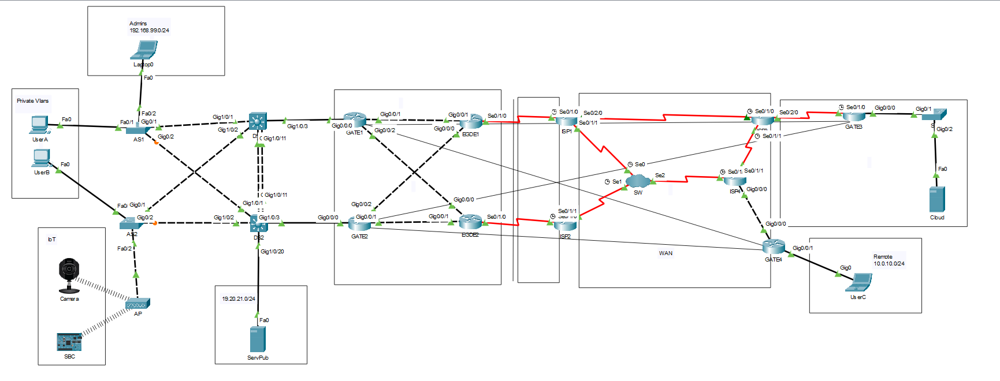

# Enterprise Site-to-Site IPsec VPN with Redundancy


## 📖 Project Overview
This project involves the implementation of a secure, redundant Site-to-Site IPsec VPN infrastructure for an enterprise network. Moving away from unencrypted GRE tunneling, this solution leverages IPsec to ensure confidentiality, integrity, and authentication for data traversing public WANs.

The architecture connects an Enterprise HQ (utilizing dual edge routers for redundancy) to a Remote Public Cloud provider and a Remote Private branch. Key challenges addressed in this implementation include configuring ISAKMP policies, managing cryptographic maps across redundant gateways, and implementing NAT exemption to allow VPN traffic to bypass Network Address Translation mechanisms.

## 🗺️ Network Topology

*(Click the image to view full resolution)*

## ⚙️ Key Features / Technologies

* **IPsec Tunnel Mode:** Encapsulates the entire original IP packet for secure transport across public networks (Layer 3 Security).
* **ISAKMP (IKE Phase 1):** Establishes a secure management channel using SHA hashing, AES encryption, Pre-Shared Keys (PSK), and Diffie-Hellman Group 5.
* **IPsec Profiles (IKE Phase 2):** Defines the transformation sets (`esp-aes`, `esp-sha-hmac`) used to encrypt the actual data payload.
* **VPN Redundancy:** Configures a single remote gateway (GATE3) to accept connections from two different Enterprise edge routers (EDGE1 and EDGE2) for failover capability.
* **NAT Exemption (NAT Traversal):** Modifies Access Control Lists (ACLs) to ensure VPN traffic is not translated by NAT overload, allowing successful tunnel negotiation for branches behind NAT (GATE4).
* **Security License Activation:** Enabling the `securityk9` technology package on Cisco ISR G2 routers.

## 💻 Configuration Snippets

### 1. Security License Activation
Before configuring VPN features, the security module must be enabled on the routers.
```cisco
! Enable Security Technology Package
license boot module c2900 technology-package securityk9
or on newer routers
license boot level securityk9
! Save and Reload required
write mem
reload
```

### 2. ISAKMP (Phase 1) Policy
Defining the parameters for the management tunnel (HAGLE: Hash, Auth, Group, Lifetime, Encryption).
```cisco
! Configure ISAKMP Policy
crypto isakmp policy 100
 hash sha
 authentication pre-share
 group 5
 lifetime 3600
 encryption aes
 exit

! Define Pre-Shared Key for the Peer
crypto isakmp key cisco123 address 200.1.1.2
```

### 3. IPsec (Phase 2) & Interesting Traffic
Defining what traffic to encrypt and how to encrypt it.
```cisco
! Define Interesting Traffic (ACL)
! Matches traffic from Enterprise VLAN 11 to Remote Cloud
access-list 102 permit ip 192.168.91.0 0.0.0.255 200.1.2.0 0.0.0.255

! Configure Transform Set (Encryption/Hashing)
crypto ipsec transform-set ENT-TO-PUB esp-aes esp-sha-hmac
```

### 4. Crypto Map Configuration
Binding the Phase 1 and Phase 2 configurations to an interface.
```cisco
! Create Crypto Map
crypto map VPN-MAP1 101 ipsec-isakmp 
 set peer 200.1.1.2
 set transform-set ENT-TO-PUB 
 match address 102
 exit

! Apply to WAN Interface
interface Serial0/1/0
 crypto map VPN-MAP1
```

### 5. Redundancy Configuration (Remote Side)
On the remote gateway (GATE3), we configure one crypto map with either multiple sequence numbers or multiple peers to handle connections from both Enterprise Edge routers.
```cisco
crypto map VPN-MAP1 101 ipsec-isakmp 
 set peer 19.20.23.1 ! Sequence 11 for EDGE1
 set peer 19.20.23.5 ! Sequence 12 for EDGE2 (Failover/Redundancy)
 set transform-set ENT-TO-PUB 
 match address 102
 exit
```

### 6. NAT Exemption (For Branch Behind NAT)
Traffic destined for the VPN tunnel must be denied in the NAT ACL so it isn't translated to the public interface IP.
```cisco
ip access-list extended NAT
 ! Deny VPN traffic from NAT (Do not translate)
 deny ip 10.0.10.0 0.0.0.255 192.168.0.0 0.0.255.255
 ! Permit other traffic for Internet access
 permit ip any any
```

## 🚀 Verification & Validation

### Status Commands
Use the following commands to verify the tunnel establishment:

* **Check Phase 1 (ISAKMP):**
    ```cisco
    show crypto isakmp sa
    ```
    *Expected Output:* State should be `QM_IDLE`.

* **Check Phase 2 (IPsec):**
    ```cisco
    show crypto ipsec sa
    ```
    *Expected Output:* Look for non-zero values in `#pkts encaps` and `#pkts encrypt`.

* **Verify Crypto Map Binding:**
    ```cisco
    show crypto map
    ```

### Connectivity Testing
* **Ping Test:**
    Ping from a userA to the remote network.
    ```cisco
    ping 200.1.2.2
    ```

* **Trace Route (Verification of Tunneling):**
    When tracing to the destination, the intermediate public hops (ISP routers) should be hidden, as the packet is encapsulated.
    ```dos
    tracert 200.1.2.2
    ```
